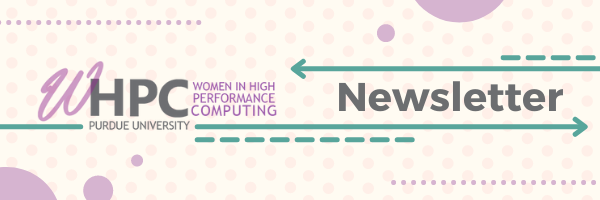

```{r setup, include=FALSE}
knitr::opts_chunk$set(echo = TRUE)
```


## Hello World!

Welcome to our first newsletter-style email. We hope to continute to bring you update on events and opportunities in the HPC space. 

## Long Tales of Science Podcast

Because we have not been able to host in-person events, one of our recent initiatives was to start an interview podcast. In this podcast, we interview women in HPC about their research, career paths, and what it means to be a woman in technology. The goal of the podcast is to increase the representation of women in the field. Interviewees come from industry, academia, government, science, engineering, social science, and the humanities.

You can find the podcast on [Spotify](https://open.spotify.com/show/6cMtOYaV6w0gSmeJzlIKHI?si=0e079a574d09432a), [Apple Podcasts](https://podcasts.apple.com/us/podcast/long-tales-of-science/id1524239688), [Google Podcasts](https://podcasts.google.com/feed/aHR0cHM6Ly93d3cuYnJlYWtlci5hdWRpby9mZWVkcy8xNzcyNjQ4LnJzcz9wYWdlPTAmcGVyX3BhZ2U9MTAw), or you favorite podcast platform. 

### New Episode

In this [most recent episode](https://open.spotify.com/episode/74Sh5BA7Nng96Ei4n01IFj?si=e4esDJujQkmWVVr07L5PqQ) we, interview Nancy Wilkins-Diehr, former associate director of the San Diego Supercomputer Center. In this episode, we talk about Nancy’s pathway into HPC and her involvement in TeraGrid, XSEDE, and the Science Gateways Community Institute. We also discuss the state of software-related contributions in academia, project management, navigating a career in tech, and her recent retirement. 

## Upcoming Event

### How does HPC help with your scientific research: Faculty perspectives

One of our former founders is still doing great work for Women in HPC at our sister chapter in Virginia. This event features women research leaders of the Commonwealth sharing and discussing how HPC has facilitated their scientific research and professional careers. **[Register now](https://virginia.zoom.us/meeting/register/tJYsdu6gqzkoGNJ0boZJfJl7TJr3IrQpvgwM)** to join us for this event **next Monday Jan 25, 2022, 01:00 PM EST**.

#### Featured Speakers:

- [Anne Brown](https://www.biochem.vt.edu/people/faculty/anne-brown.html) - Virginia Tech
She is an Assistant Professor of Biochemistry, Science Informatics Consultant, and Health Analytics Coordinator at Virginia Tech. Her research interests include utilizing computational modeling to answer biological questions and aid in drug discovery and the application of computational molecular modeling to elucidate the relationship between structure, function, and dynamics of biomolecules.

- [Jenna Cann](https://science.gsfc.nasa.gov/sed/bio/jenna.cann) - George Mason University
 She is a postdoctoral fellow at NASA Goddard Space Flight Center. Jenna received a PhD in Physics from George Mason University. Her research focuses on studying black holes in dwarf and low metallicity galaxies, in an effort to constrain the origins of supermassive black holes that can be up to billions of times the mass of our Sun. To do this, they use both theoretical modeling with the Cloudy spectral simulation code and infrared and X-ray observations to determine the most effective ways to find these elusive objects. Jenna currently serves as a co-officer in the NASA Goddard Association for Postdoctoral and Early Career Scholars (NGAPS+) and was a co-founder of the GMU Physics and Astronomy department’s diversity, equity, inclusion, and accessibility (DEIA) organization, SPECTRUM.
 
- [Alexis Edwards](https://vipbg.vcu.edu/people/alexis-edwards/) - Virginia Commonwealth University
She is an Associate Professor of Psychiatry at Virginia Commonwealth University. Her research focuses on understanding the etiology of substance use disorders, suicidal behavior, and internalizing problems, including how these outcomes are related to one another.